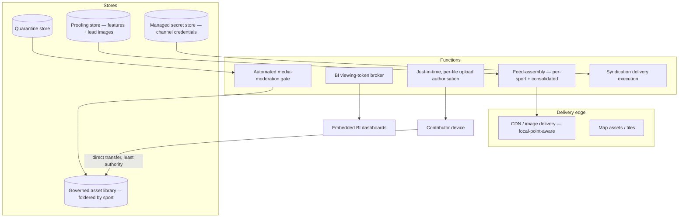

# AWS Integration — the cloud landscape

> **Source:** `sportgramme-aws / aws-integration/`  ·  consolidated from the former standalone repo (`AWS-Integration`, org project #4)
> **Audience:** hiring managers, technical due-diligence, investment partners.
> **House style:** resources are **described, not disclosed** — no endpoints, keys,
> hostnames, or bucket names.

Manages the design, development and deployment of the integration Sportgramme
requires with Amazon Web Services. Every *"Depends on the AWS landscape"*
reference across the other repositories resolves to something on this page.

---

## Landscape

---

## What lives here

| Resource / function | Used by | For |
|---|---|---|
| **CDN / image delivery** | web, widgets, features | Focal-point-aware hero and card imagery at any aspect ratio |
| **Map assets / tiles** | widgets | World and single-fixture maps |
| **Governed asset library** | media-pipeline, features, syndication | First-party stills/video/audio, foldered by sport taxonomy, with a distinct syndication set |
| **Quarantine store + moderation gate** | media-pipeline | Probationary contributions held and vetted before promotion |
| **Just-in-time authorisation function** | media-pipeline | Short-lived, single-file, non-reusable upload permits |
| **Proofing store + feed-assembly function** | features | Stage a feature and its image, then assemble into the sport feed and the consolidated feed, then publish to the site |
| **BI token broker** | insights | Server-side short-lived, low-privilege viewing tokens so the browser never holds BI credentials |
| **Managed secret store + delivery execution** | syndication | Encrypted channel credentials; automated push of assets and features to partner endpoints |

---

## Principles

- Large files stream **straight from device to cloud** — never round-tripping through platform servers.
- Every transfer carries **only the authority its permit covers**; anything beyond it is rejected at the storage layer.
- The platform's own record of what was delivered is the **source of truth** for a batch's final state, not the contributor's device.
