# Media Pipeline — Capability Briefs

> **Source:** `sportgramme-aws / media-pipeline/`  ·  consolidated from the former standalone repo
> **Audience:** hiring managers, technical due-diligence, investment partners.
> **House style:** every item below is a capability brief — *As a / I want / So that*
> plus a conceptual mermaid diagram. It describes **what the pipeline does and the
> control it gives the business**, not transport, storage, keys, or internal
> system names.

The media pipeline is how accredited contributors get stills, video and audio
**off a camera or phone at a venue and into Sportgramme's governed asset library**,
safely and at volume. It is designed so that:

- nothing leaves the contributor's device until the platform has authorised it,
- every transfer carries only the authority it was granted — no more,
- untrusted contributions are quarantined and moderated before they can be seen,
- and the platform's record of what was delivered is always the source of truth.

---

## Capability map

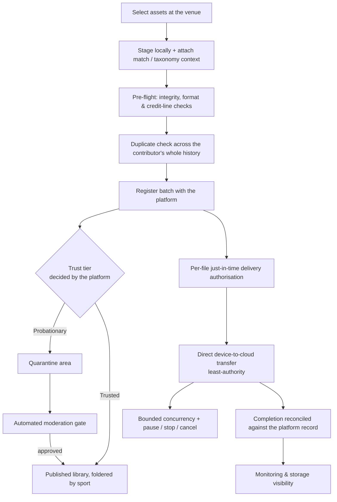

---

## EPIC — Contributors deliver match-day media into the governed library

**As** Sportgramme
**I want** accredited contributors to move large volumes of match-day media from
the field into the governed asset library through one controlled pipeline
**So that** the platform gains a steady supply of first-party imagery and footage
while retaining full control over what is admitted, where it lands, and who may
see it.

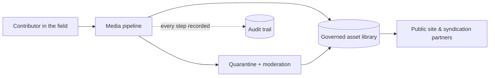

*Tracked sub-issues below. Cross-cutting dependencies link to
`SG API Internal Landscape` (#3), `SG AWS Landscape` (#4) and
`SG Authorisations & Security` (#2).*

---

## 1. Stage a batch with match context before anything is sent

**As a** photojournalist at a fixture
**I want** to select a set of assets and attach the match, venue and
classification they belong to before any upload begins
**So that** every asset is correctly catalogued from the outset and I can review
the whole batch locally before committing it.

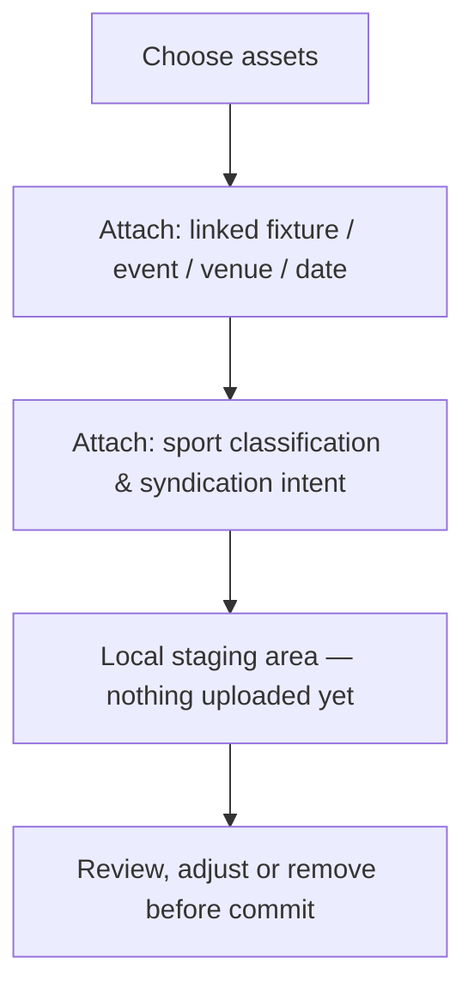

Match linkage is optional — unattached assets are still accepted and routed to an
"unclassified" holding for later cataloguing.

---

## 2. Pre-flight integrity, format and credit-line checks

**As** the asset library owner
**I want** every staged asset checked for file integrity, an approved aspect
ratio, and a clean credit line before it can be queued
**So that** unusable, malformed or non-compliant assets are stopped at the
contributor's screen rather than consuming delivery capacity or polluting the
library.

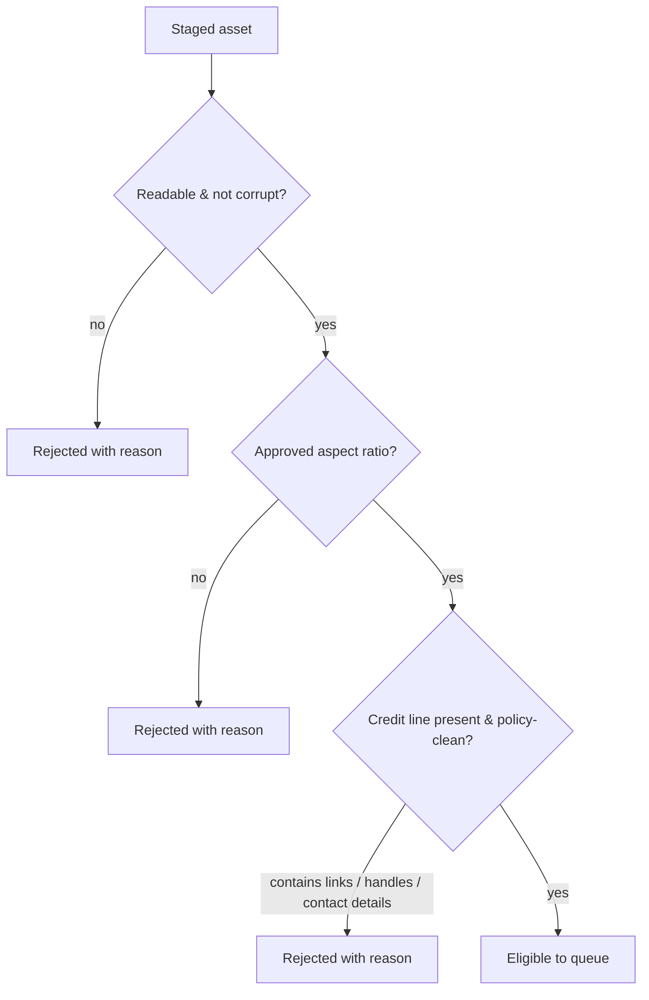

The pipeline also protects itself: if a previous session was left in a bad state
by a problem asset, the next load recovers cleanly rather than failing again.

---

## 3. Prevent duplicate assets across the contributor's whole history

**As** the platform
**I want** an asset that has already been processed — in this batch or any past
batch — to be recognised and refused
**So that** the library is not filled with re-uploads and contributors get a clear
pointer to where the original already lives.

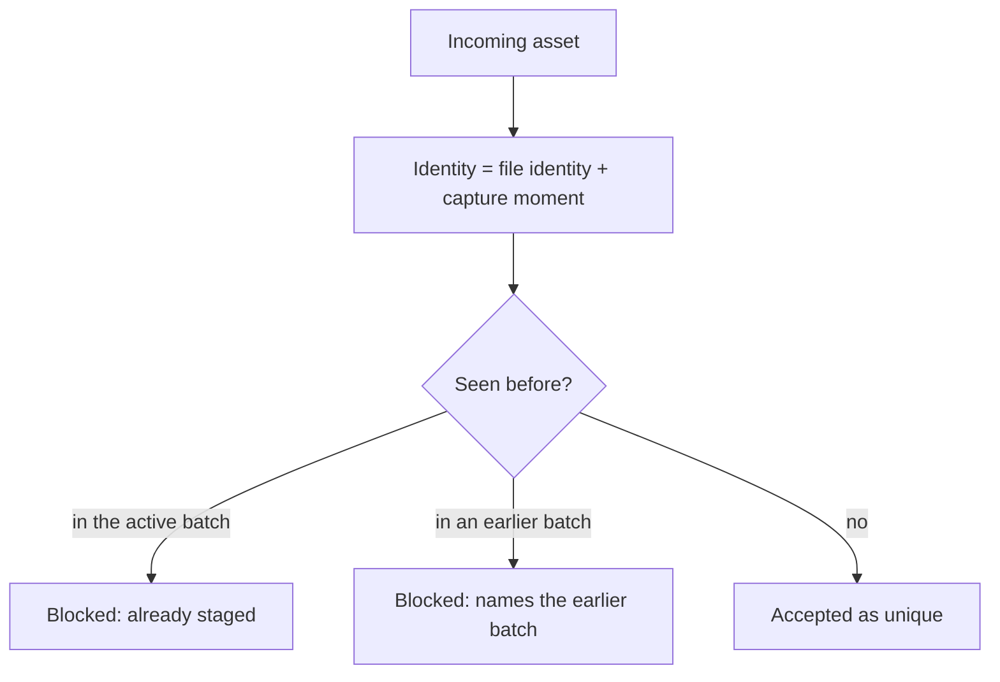

---

## 4. Platform-authoritative batch registration and trust tiering

**As** Sportgramme
**I want** the platform — not the contributor's device — to assign the batch its
identity, its trust tier and its destination
**So that** a contributor can never elect to place their own material straight
into the published library, regardless of what their client sends.

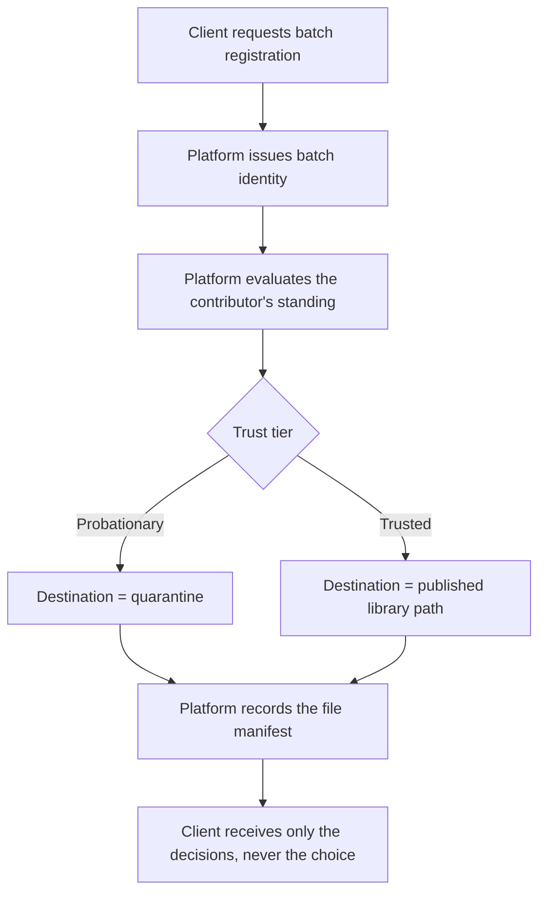

> **Depends on #3** — Core "register batch / manifest" contract.
> **Depends on #2** — contributor standing / trust grant.

---

## 5. Just-in-time, per-file delivery authorisation

**As** the security architect
**I want** delivery authorisation to be requested one file at a time, at the
moment of transfer, and to be short-lived
**So that** there is never a stockpile of reusable upload permits, and a permit
that leaks is worthless within moments.

```mermaid
sequenceDiagram
    participant Client
    participant Platform
    participant Cloud as Cloud storage
    Client->>Platform: Request permit for this one file, now
    Platform-->>Client: Short-lived, single-purpose permit
    Client->>Cloud: Transfer using the permit
    Note over Client,Cloud: Permit expires shortly after; not reusable
```

> **Depends on #3** — Core "just-in-time authorisation" contract.

---

## 6. Direct device-to-cloud transfer with least authority

**As** the platform
**I want** assets to stream straight from the contributor's device to cloud
storage, with the client sending only exactly what its permit covers
**So that** large files never round-trip through platform servers, and a transfer
cannot smuggle extra data or headers past what was authorised.

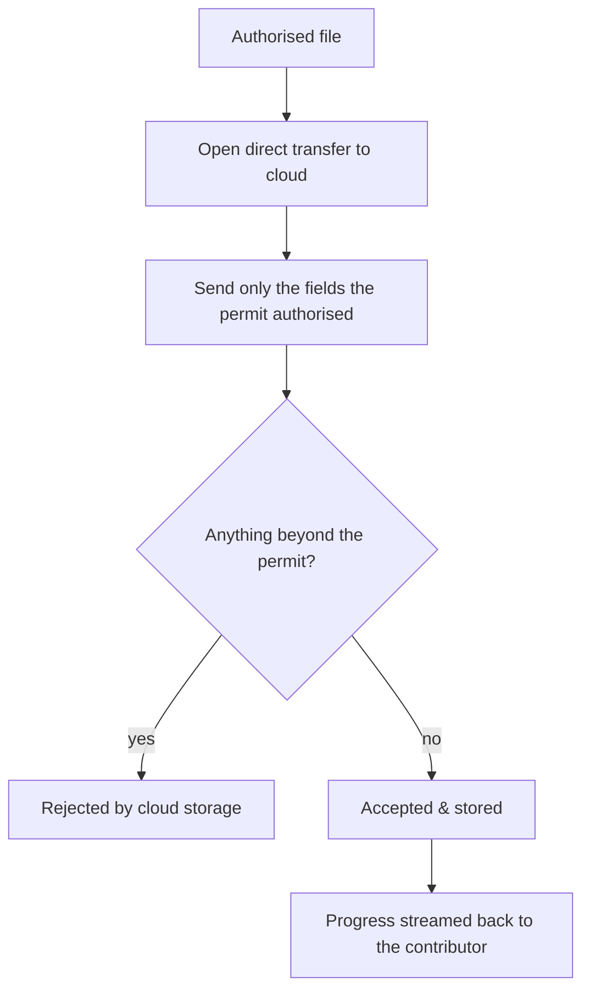

> **Depends on #4** — cloud storage target, authorisation function, metadata contract.

---

## 7. Bounded concurrency, live telemetry and granular control

**As a** contributor uploading a large batch on venue Wi-Fi
**I want** a controlled number of parallel transfers, a live progress read on
each file, and the ability to pause, stop-and-reset or cancel any single file or
the whole batch
**So that** I can manage a slow or unreliable connection without losing the work
already done.

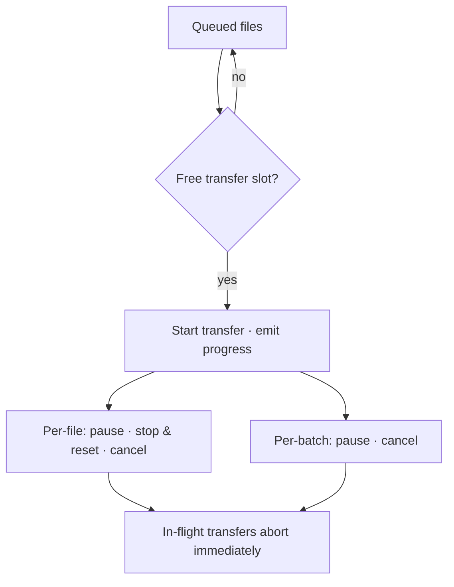

---

## 8. Trust-tiered routing and the automated moderation gate

**As** Sportgramme
**I want** probationary contributions held in a quarantine area and passed through
an automated moderation gate before promotion, while trusted contributions land
directly in the library foldered by sport, with a distinct set for syndication
**So that** the published library only ever contains vetted material, and its
structure stays consistent no matter who contributed.

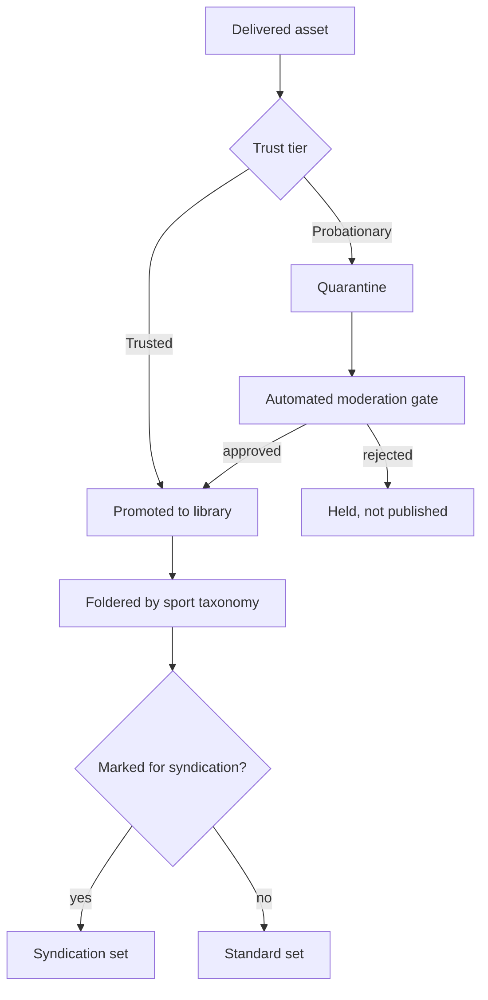

> **Depends on #4** — quarantine store, moderation function, library layout.

---

## 9. Completion reconciled against the platform record

**As** the platform
**I want** a batch's final state to be settled by the platform's own record of
what was delivered, not by the contributor's device
**So that** a lost network response can never leave a delivered batch looking
failed, or a failed one looking complete.

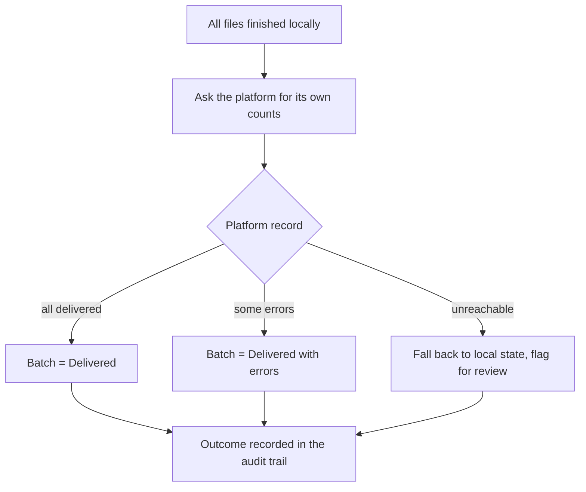

> **Depends on #3** — Core "batch file status / finalise" contract.

---

## 10. Monitoring and storage visibility

**As** an operations lead
**I want** a live view of in-flight and recent batches, the state of the cloud
storage targets, and how much storage each contributor is consuming
**So that** problems are visible as they happen and capacity can be managed ahead
of need.

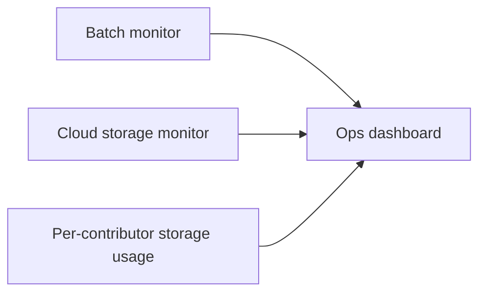

---

## Dependency summary

| Sub-issue | Needs from platform | Tracked on |
|---|---|---|
| 4 · Batch registration & trust tiering | Register-batch / manifest contract; contributor standing | #3, #2 |
| 5 · Just-in-time authorisation | Per-file short-lived authorisation contract | #3 |
| 6 · Direct device-to-cloud transfer | Cloud storage target; authorisation function; metadata contract | #4 |
| 8 · Trust-tiered routing & moderation | Quarantine store; automated moderation function; library layout | #4 |
| 9 · Completion reconciliation | Batch file-status / finalise contract | #3 |
| all | Capability code + access guard for the pipeline | #2 |
